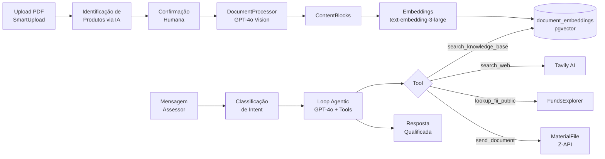
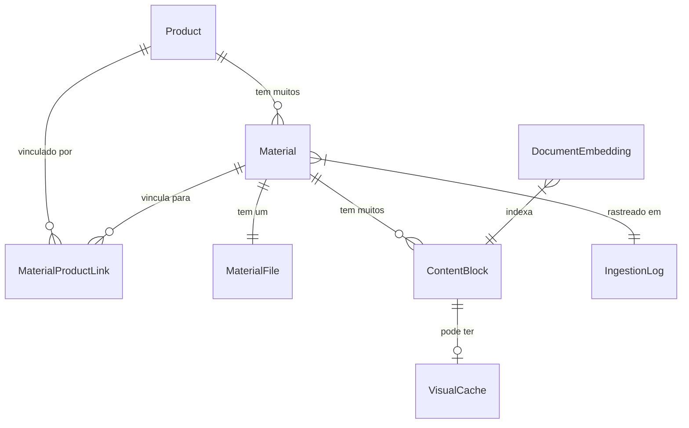
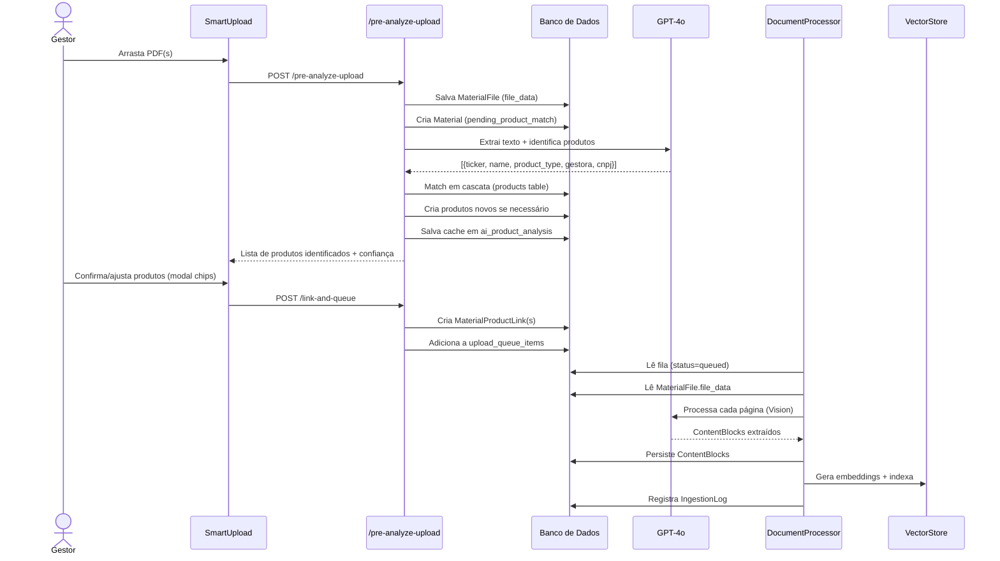
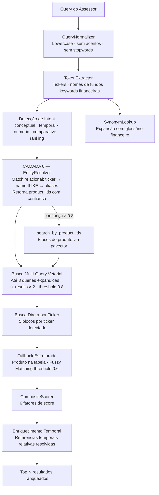
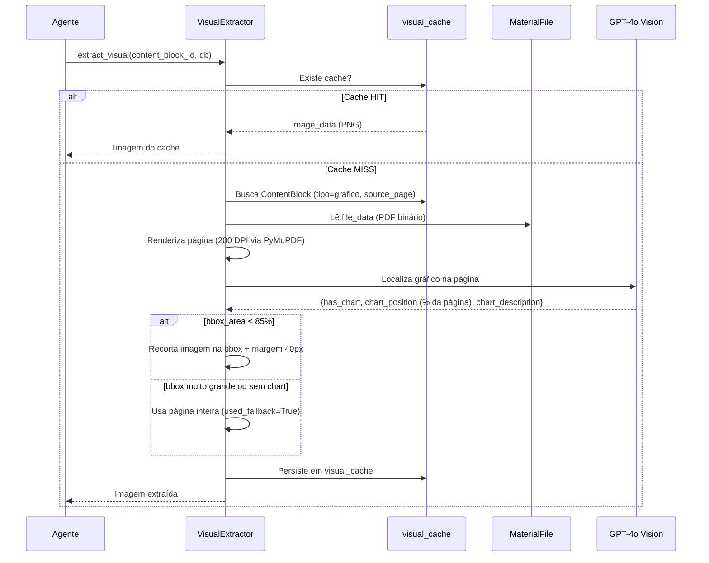
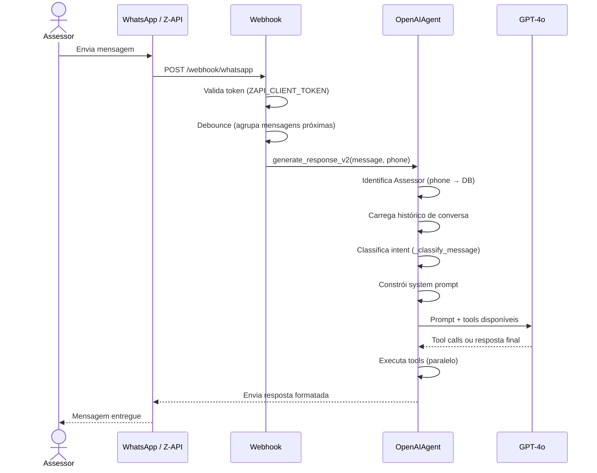
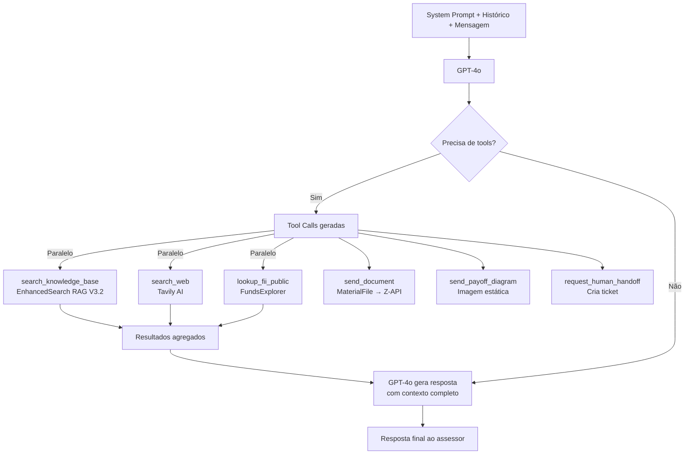

# Base de Conhecimento do Agente Stevan

> Documento de referência técnica — descreve o funcionamento completo do sistema RAG (Retrieval-Augmented Generation) do agente Stevan, desde o upload de um material até a composição da resposta qualificada entregue ao assessor.

---

## Sumário

1. [Visão Geral da Arquitetura](#1-visão-geral-da-arquitetura)
2. [Modelos de Dados](#2-modelos-de-dados)
3. [Pipeline de Upload e Ingestão](#3-pipeline-de-upload-e-ingestão)
4. [Indexação Vetorial](#4-indexação-vetorial)
5. [Pipeline de Busca Semântica — RAG V3.2](#5-pipeline-de-busca-semântica--rag-v32)
6. [Sistema Visual — VisualCache](#6-sistema-visual--visualcache)
7. [Pipeline Agentic RAG V2 — Geração de Resposta](#7-pipeline-agentic-rag-v2--geração-de-resposta)
8. [Separação de Fontes e Citação Obrigatória](#8-separação-de-fontes-e-citação-obrigatória)
9. [Observabilidade e Auditoria](#9-observabilidade-e-auditoria)
10. [Referência Rápida de Componentes](#10-referência-rápida-de-componentes)

---

## 1. Visão Geral da Arquitetura

O Stevan opera sobre uma arquitetura de três grandes fases: ingestão, indexação e geração.



O centro de tudo é o **Produto** (`Product`). O agente pensa em produtos, não em documentos. Todo material enviado é obrigatoriamente vinculado a um ou mais produtos antes de ser indexado.

---

## 2. Modelos de Dados

### Diagrama de Relacionamentos



---

### 2.1 `Product` — Produto Financeiro

**Tabela:** `products`

O produto é a entidade central do sistema. Representa um ativo negociável: FII, ação, ETF, COE, derivativo estruturado, CRI, CRA, debênture, etc.

| Campo | Tipo | Papel no sistema |
|---|---|---|
| `id` | Integer | Chave primária |
| `name` | String(255) | Nome completo do produto |
| `ticker` | String(50) | Código de negociação (ex: `BTLG11`, `PETR4`) |
| `manager` | String(255) | Gestora ou emissor |
| `category` | String(100) | Categoria principal (ex: "FII", "Ações") |
| `categories` | Text (JSON) | Lista completa de categorias |
| `product_type` | String(50) | Tipo técnico: `fii`, `acao`, `etf`, `estruturada`, `debenture`, etc. |
| `key_info` | Text (JSON) | Metadados extras extraídos pela IA: CNPJ, emissor, retorno esperado, prazo, risco |
| `name_aliases` | Text (JSON) | Apelidos alternativos (ex: `["TG Core", "TG Genial"]`) — usados no EntityResolver |
| `valid_from` / `valid_until` | DateTime | Janela de validade para filtragem temporal |
| `status` | String | `ativo` ou `inativo` — somente ativos aparecem nas buscas |

**Papel nas consultas:** O `EntityResolver` faz match do texto da pergunta do assessor contra `ticker`, `name` e `name_aliases` para identificar o produto antes da busca vetorial. O `product_id` é depois usado para filtrar os embeddings na tabela `document_embeddings`.

---

### 2.2 `Material` — Agrupador de Conteúdo

**Tabela:** `materials`

O material representa um documento com finalidade específica. Um produto pode ter múltiplos materiais de tipos diferentes.

| Campo | Tipo | Papel no sistema |
|---|---|---|
| `id` | Integer | Chave primária |
| `product_id` | Integer FK | Produto primário (compatibilidade retroativa) |
| `material_type` | Enum | `comite`, `research`, `one_page`, `apresentacao`, `taxas`, `campanha`, `treinamento`, `faq`, `regulatorio`, `script`, `outro` |
| `name` | String(255) | Nome descritivo |
| `publish_status` | String | `rascunho`, `publicado`, `arquivado` — só materiais `publicado` são indexados |
| `is_indexed` | Boolean | Flag: conteúdo já foi vetorizado no pgvector |
| `is_committee_active` | Boolean | Flag: material está ativo como **fonte primária do agente** (Comitê Ativo) |
| `available_for_whatsapp` | Boolean | Permite que o agente envie o PDF via WhatsApp |
| `ai_summary` | Text | Resumo conceitual gerado por GPT-4o-mini automaticamente após ingestão |
| `ai_themes` | Text (JSON) | Temas principais identificados pela IA |
| `ai_product_analysis` | Text (JSON) | **Cache temporário** dos produtos detectados pela IA durante o `pre-analyze-upload` — usado para popular o modal de confirmação |
| `processing_status` | String | Estado do pipeline: `pending`, `processing`, `success`, `failed`, `pending_product_match` |
| `extracted_metadata` | Text (JSON) | Metadados extraídos na análise inicial: `fund_name`, `ticker`, `gestora`, `confidence` |
| `valid_from` / `valid_until` | DateTime | Validade do material — materiais expirados são filtrados nos resultados |

**Papel nas consultas:** O campo `is_committee_active` determina a marcação `[COMITÊ]` nos resultados — o agente usa linguagem de recomendação formal apenas para esses chunks. O `available_for_whatsapp` determina se o material aparece na lista "Materiais com PDF disponível" injetada no system prompt.

---

### 2.3 `MaterialFile` — Arquivo Binário

**Tabela:** `material_files`

Armazena o PDF bruto em banco. É a fonte de verdade para o arquivo — não depende de sistema de arquivos efêmero.

| Campo | Tipo | Papel no sistema |
|---|---|---|
| `material_id` | Integer FK (unique) | Relação 1:1 com o material |
| `filename` | String(255) | Nome original do arquivo |
| `content_type` | String(100) | MIME type (geralmente `application/pdf`) |
| `file_data` | LargeBinary | Conteúdo binário do PDF |
| `file_size` | Integer | Tamanho em bytes |

**Papel nas consultas:** Quando o assessor pede para "enviar o PDF", a tool `send_document` busca `MaterialFile.file_data` pelo `material_id` e envia via Z-API. O `VisualExtractor` também lê `file_data` sob demanda para renderizar páginas e extrair imagens de gráficos.

---

### 2.4 `MaterialProductLink` — Vínculo Multi-Produto

**Tabela:** `material_product_links`

Um material pode cobrir múltiplos produtos (ex: um relatório de research que menciona BTLG11, HGLG11 e XPLG11). Esta tabela registra todos os vínculos além do produto primário.

| Campo | Tipo | Papel no sistema |
|---|---|---|
| `material_id` | Integer FK | Material vinculado |
| `product_id` | Integer FK | Produto vinculado |
| `excluded_from_committee` | Boolean | Se este produto está excluído do escopo do Comitê Ativo neste material |

**Constraint:** `UNIQUE(material_id, product_id)` — sem duplicatas.

**Papel nas consultas:** A busca por produto na camada 0 (EntityResolver) retorna chunks de todos os materiais linkados ao produto encontrado, não apenas o material primário. Isso garante que um assessor perguntando sobre HGLG11 receba conteúdo de um research que menciona o fundo como comparativo, mesmo que o material primário seja outro produto.

---

### 2.5 `ContentBlock` — Unidade Semântica Indexável

**Tabela:** `content_blocks`

É o menor pedaço de conteúdo do sistema e a **fonte real dos embeddings**. Cada bloco é gerado durante o processamento do PDF e representa um fragmento coeso de informação.

| Campo | Tipo | Papel no sistema |
|---|---|---|
| `id` | Integer | Chave primária |
| `material_id` | Integer FK | Material de origem |
| `block_type` | Enum | `texto`, `tabela`, `grafico`, `imagem`, `script` |
| `content` | Text | Conteúdo do bloco — texto livre ou JSON estruturado para tabelas |
| `source_page` | Integer | Página do PDF de origem (para rastreabilidade e extração visual) |
| `is_high_risk` | Boolean | Flag para revisão manual (blocos com taxas, custos, percentuais) |
| `semantic_tags` | Text (JSON) | Tags semânticas geradas pela IA |
| `confidence_score` | Integer | 0–100 — confiança da extração |
| `status` | Enum | `auto_approved`, `pending_review`, `approved`, `rejected` |
| `visual_description` | Text | Descrição textual do conteúdo visual (para blocos `grafico`/`imagem`) |

**Papel nas consultas:** O conteúdo dos blocos é o que o agente recebe como contexto. Blocos do tipo `tabela` armazenam JSON estruturado que é resolvido em texto legível em tempo de consulta — o agente nunca vê o JSON bruto, apenas a tabela formatada. Blocos do tipo `grafico` têm `source_page` necessária para que o `VisualExtractor` extraia a imagem sob demanda.

---

### 2.6 `DocumentEmbedding` — Vetor Semântico

**Tabela:** `document_embeddings`

Armazena o vetor de embedding de cada `ContentBlock` junto com seus metadados desnormalizados para busca eficiente.

| Campo | Tipo | Papel no sistema |
|---|---|---|
| `doc_id` | String (unique) | Identificador único do chunk |
| `content` | Text | Texto do bloco (cópia para recuperação) |
| `embedding` | Vector(3072) | Vetor gerado por `text-embedding-3-large` |
| `product_ticker` | String(50) | Ticker do produto — filtro prioritário e fator de scoring |
| `gestora` | String(200) | Gestora — fator de scoring |
| `category` | String(200) | Categoria do produto |
| `material_type` | String(100) | Tipo do material de origem |
| `publish_status` | String(50) | Status do material — só `publicado` é retornado |
| `valid_until` | String(100) | Data de expiração — filtrada em tempo de query |
| `block_id` | String(100) | Referência ao `ContentBlock.id` |
| `material_id` | String(100) | Referência ao `Material.id` |
| `structure_slug` | String(200) | Slug de estrutura de derivativo (para `send_payoff_diagram`) |
| `block_type` | String(100) | Tipo de bloco (`texto`, `tabela`, etc.) |

**Papel nas consultas:** A busca vetorial usa o operador `<=>` do pgvector para calcular distância cosseno entre o embedding da query e todos os documentos. Os campos `product_ticker` e `gestora` entram diretamente no **score composto** como fatores de boost além da similaridade vetorial pura.

---

### 2.7 `VisualCache` — Cache de Imagens

**Tabela:** `visual_cache`

Armazena imagens e gráficos extraídos de PDFs vinculados a `ContentBlock`s do tipo `grafico`. **A extração é lazy (sob demanda)** — não acontece durante a ingestão do documento, mas sim quando o agente precisa enviar a imagem.

| Campo | Tipo | Papel no sistema |
|---|---|---|
| `content_block_id` | Integer FK (unique) | Bloco de conteúdo associado (1:1) |
| `image_data` | LargeBinary | Imagem PNG em bytes |
| `mime_type` | String(50) | Tipo da imagem (geralmente `image/png`) |
| `bbox` | Text | Coordenadas da bounding box usada no recorte (em % da página) |
| `used_fallback` | Boolean | Se a extração usou a página inteira por falta de bbox precisa |
| `last_accessed_at` | DateTime | Última vez que o cache foi acessado |

**Papel nas consultas:** Quando o agente decide enviar uma imagem, o `VisualExtractor` verifica primeiro se há cache. Em caso de miss, renderiza a página do PDF via PyMuPDF, chama GPT-4o Vision para localizar o gráfico (bounding box), recorta e persiste. Na próxima chamada, o cache é retornado diretamente.

---

### 2.8 `RetrievalLog` — Auditoria de Buscas

**Tabela:** `retrieval_logs`

Rastreia cada busca realizada pelo agente para análise de qualidade e diagnóstico.

| Campo relevante | Descrição |
|---|---|
| `query` | Texto exato da query de busca |
| `query_type` | Intent detectada: `conceptual`, `temporal`, `numeric`, `comparative`, `ranking` |
| `chunks_retrieved` | JSON com IDs dos chunks recuperados |
| `chunks_used` | JSON com IDs dos chunks efetivamente usados |
| `min_distance` / `max_distance` | Distância cosseno mínima e máxima |
| `entities_detected` | JSON com tickers/produtos identificados na query |
| `composite_score_max` | Maior score composto retornado |
| `web_search_used` | Se a busca web foi ativada nessa interação |
| `is_comparative` | Se foi uma query comparativa (ex: "compare MANA11 com LIFE11") |
| `intent_detected` | Intent macro: `DOCUMENTAL`, `MERCADO`, `PITCH`, etc. |

---

### 2.9 `IngestionLog` — Auditoria de Ingestão

**Tabela:** `ingestion_logs`

Rastreia o pipeline de processamento de cada documento.

| Campo relevante | Descrição |
|---|---|
| `material_id` | Material processado |
| `total_pages` | Total de páginas no PDF |
| `blocks_created` | Número de ContentBlocks gerados |
| `tables_detected` | Tabelas identificadas pela IA |
| `charts_detected` | Gráficos identificados |
| `processing_time_ms` | Tempo total de processamento |
| `status` | `success`, `partial`, `failed` |
| `details_json` | JSON completo com detalhes por página |

---

## 3. Pipeline de Upload e Ingestão

### 3.1 Fluxo Geral



---

### 3.2 Step 1 — SmartUpload (Frontend)

O assessor ou gestor arrasta um ou mais PDFs para o SmartUpload. Os arquivos são enviados com metadados básicos (tipo de material, categorias, vigência).

**Arquivo:** `frontend/react-knowledge/src/pages/SmartUpload.jsx`

---

### 3.3 Step 2 — `pre-analyze-upload` (Identificação de Produtos)

**Endpoint:** `POST /api/products/pre-analyze-upload`

Este endpoint realiza a análise preliminar do PDF para identificar a quais produtos o documento se refere, **sem ainda indexar nada**.

**Processo interno:**

1. **Salva o arquivo** na tabela `material_files` (campo `file_data` — LargeBinary).
2. **Cria o `Material`** com status `pending_product_match`.
3. **Extrai texto do PDF** via PyMuPDF (`fitz`) no modo `get_text("dict")`:
   - Lê **todas as páginas** do documento.
   - Agrupa linhas por coordenada Y (tolerância de 2pt) — células da mesma linha de tabela são concatenadas com separador `" | "`, preservando estrutura tabular.
   - **Sampler estratificado** para PDFs longos (>20 páginas):
     - Orçamento total: 20.000 caracteres.
     - Dividido em 3 segmentos com orçamentos independentes: início (30%), meio (40%), fim (30%).
     - Garante cobertura real do documento sem viés frontal.
   - PDFs curtos (≤20 páginas): lê tudo, trunca em 20.000 caracteres.

4. **Análise via GPT-4o** com prompt especializado:
   - Reconhece padrões de ticker brasileiros: `XXXX11` (FII), `XXXX3`/`XXXX4` (ações), ETF, BDR, CRI, CRA, debênture, POP, Collar, COE.
   - Extrai para cada produto identificado: `ticker`, `name`, `product_type`, `gestora`, `cnpj`.
   - Instrução explícita para não omitir itens em tabelas e notas de rodapé.
   - Retorna JSON estruturado (até `max_tokens: 2000`).

5. **Match em cascata** contra o banco de dados:
   - **Nível 1 — Ticker exato:** `Product.ticker == ticker` (case-insensitive).
   - **Nível 2 — ILIKE:** `Product.ticker ILIKE ticker`.
   - **Nível 3 — Prefixo:** `Product.ticker ILIKE "{4 primeiras letras}%"` (captura PETR3 e PETR4 via "PETR").
   - **Nível 4 — Nome:** `Product.name ILIKE "%{name}%"`.
   - **Nível 5 — Aliases:** itera `Product.name_aliases` (JSON array) buscando correspondência.
   - Retorna `match_confidence`: `exact`, `ilike`, `prefix`, `name`, ou `alias`.
   - Se nenhum match: produto marcado como `new` (será criado).

6. **Cria produtos novos** quando necessário, populando: `ticker`, `manager`, `product_type`, `categories`, `description`, e `key_info` (JSON com CNPJ e outros metadados extraídos pela IA).

7. **Armazena resultado** em `Material.ai_product_analysis` (cache JSON) para exibição no modal.

**Resposta:** Lista de produtos identificados com nome, ticker, tipo, confiança do match, e flag `is_new`.

---

### 3.4 Step 3 — Confirmação Humana (Modal de Chips)

O frontend exibe o modal "Produtos Identificados pela IA" com:
- Chips clicáveis (verde = selecionado, vermelho = excluído) para cada produto identificado.
- Badge de confiança do match (`exato`, `ilike`, `prefixo`, `nome`, `alias`).
- Campo de texto para adicionar produtos adicionais não detectados.

O gestor confirma ou ajusta a seleção antes de qualquer indexação.

---

### 3.5 Step 4 — `link-and-queue` (Vinculação e Fila)

**Endpoint:** `POST /api/products/{material_id}/link-and-queue`

1. **Cria `MaterialProductLink`** para cada produto confirmado.
2. **Adiciona à fila** de processamento (`upload_queue_items`) com status `queued`.
3. **Inicia `DocumentProcessor`** em background thread.

---

### 3.6 Step 5 — `DocumentProcessor` (Extração de Conteúdo)

**Arquivo:** `services/document_processor.py`

Processa o PDF página por página usando **GPT-4o Vision**:

1. **Renderiza** cada página como imagem (PyMuPDF) com DPI adaptativo por tipo de conteúdo:
   - Páginas de texto simples: 150 DPI
   - Páginas com tabelas: 200 DPI
   - Infográficos e gráficos: 250 DPI

2. **Classifica** o tipo de página: `Text`, `Table`, `Chart`, `Mixed`, `Infographic`.

3. **Extrai via GPT-4o Vision** para cada página:
   - `facts`: fatos objetivos extraídos (base para os ContentBlocks de texto).
   - `products_mentioned`: tickers mencionados na página.
   - `auto_tags`: tags de contexto, perfil de investidor, momento de mercado.
   - Para tabelas: JSON estruturado com cabeçalhos e linhas.
   - Para gráficos: `visual_description` — descrição textual do que o gráfico mostra.

4. **Cria `ContentBlock`s** para cada item extraído:
   - Blocos de texto → tipo `texto`.
   - Tabelas → tipo `tabela` com conteúdo JSON estruturado.
   - Gráficos → tipo `grafico` com `visual_description` e `source_page` preenchidos. **A imagem não é extraída aqui** — o campo `source_page` habilita a extração posterior sob demanda pelo `VisualExtractor`.

5. **Registra** em `IngestionLog` com estatísticas completas.

6. **Gera** `ai_summary` e `ai_themes` do material via GPT-4o-mini.

7. **Dispara indexação vetorial** automaticamente após conclusão.

---

## 4. Indexação Vetorial

**Arquivo:** `services/vector_store.py`

Após o `DocumentProcessor` concluir, cada `ContentBlock` publicado é indexado:

### 4.1 Geração de Embeddings

- **Modelo:** OpenAI `text-embedding-3-large`
- **Dimensão:** 3072
- **Input:** Conteúdo textual do `ContentBlock` enriquecido com metadados:
  ```
  Produto: {name} ({ticker})
  Gestora: {gestora}
  Tipo: {material_type}
  Conteúdo: {content}
  ```
  Tabelas JSON são convertidas para texto antes do embedding.

### 4.2 Armazenamento

Cada embedding é inserido em `document_embeddings` com os campos de metadados desnormalizados para scoring posterior:

```
doc_id          → ID único do chunk (material_id + block_id)
content         → Texto do bloco
embedding       → Vector(3072)
product_ticker  → Para EntityResolver e ticker_match no scoring
gestora         → Para gestora_match no scoring
category        → Para filtro por categoria
material_type   → Tipo do material (comite, research, etc.)
publish_status  → Só "publicado" é retornado
valid_until     → Data de expiração (filtrada em runtime)
block_id        → Referência ao ContentBlock
material_id     → Referência ao Material
```

### 4.3 Índice pgvector

O banco usa índice `ivfflat` ou `hnsw` na coluna `embedding` para busca aproximada eficiente. A distância cosseno é calculada pelo operador `<=>` do pgvector.

---

## 5. Pipeline de Busca Semântica — RAG V3.2

**Arquivo:** `services/semantic_search.py`

A busca é orquestrada pela classe `EnhancedSearch` com 10 camadas de melhoria. Cada camada é não-bloqueante — falhas numa camada não interrompem as demais.

### 5.1 Fluxo Completo



---

### 5.2 EntityResolver — Camada 0

**Classe:** `EntityResolver` em `services/semantic_search.py`

É a camada mais determinística — busca relacional direta na tabela `products`, sem vetores. Age **antes** de qualquer busca vetorial.

**Termos ambíguos ignorados** (não geram match para evitar falsos positivos): `xp`, `cdi`, `ibov`, `selic`, `ipca`, `ifix`, `dólar`, `fii`, `etf`, `bdr`, entre outros.

**Processo:**
1. Extrai tickers (regex `[A-Z]{4}\d{1,2}`) e nomes limpos da query.
2. Para cada termo:
   - Tenta `ticker ILIKE term` → confiança 1.0
   - Tenta `name ILIKE "%{term}%"` → confiança 0.6–0.9 por comprimento
   - Tenta aliases em `name_aliases` JSON → confiança 0.8
3. Retorna lista `[{product_id, name, ticker, confidence, match_type}]`.
4. Produtos com confiança ≥ 0.8 disparam busca vetorial direcionada via `search_by_product_ids` (max 5 blocos por produto).

---

### 5.3 Score Composto — 6 Fatores

O `CompositeScorer` combina 6 fatores. Os pesos somam exatamente 1.0:

**Pesos base (queries conceptual, numeric, ranking):**

| Fator | Peso | Fonte |
|---|---|---|
| `vector_score` — similaridade cosseno | **0.45** | `1.0 − distância pgvector` |
| `fuzzy_score` — match fuzzy de tokens | **0.20** | FuzzyMatcher por ticker/nome |
| `ticker_match` — ticker exato na query | **0.15** | `product_ticker` do chunk bate com ticker detectado |
| `gestora_match` — gestora na query | **0.10** | `gestora` do chunk bate com gestora detectada |
| `context_match` — produto no histórico | **0.05** | Produto apareceu nas últimas mensagens |
| `recency_score` — recência do material | **0.05** | Materiais mais recentes → score mais alto |

**Pesos ajustados para queries temporais:**

| Fator | Peso temporal |
|---|---|
| `vector_score` | 0.35 |
| `fuzzy_score` | 0.15 |
| `ticker_match` | 0.10 |
| `gestora_match` | 0.08 |
| `context_match` | 0.07 |
| `recency_score` | **0.25** (peso 5× maior) |

**Boost por intent** (aplicado após o score base):

| Intent | Tipo de boost |
|---|---|
| `numeric` | +0.15 para blocos `tabela`, `key_metrics`, `chart`; +0.08 para tópicos de dividendos/performance |
| `ranking` | +0.10 para blocos comparativos; +0.08 para tabelas |

---

### 5.4 Queries Comparativas

Quando a intent é `comparative` (ex: "compare MANA11 com LIFE11"), o sistema:
1. Detecta múltiplos tickers.
2. Executa busca separada para cada entidade (max 3 por entidade).
3. Garante representação equilibrada no contexto final via `_ensure_entity_coverage`.
4. Se "os dois" ou "ambos" aparecerem sem tickers explícitos, usa `ConversationContextManager` para resolver pelos produtos da última mensagem.

---

### 5.5 Resolução de ContentBlocks JSON

Blocos do tipo `tabela` armazenam conteúdo em JSON estruturado (cabeçalhos + linhas). Em tempo de consulta, o agente recebe esse JSON convertido para texto formatado como tabela Markdown, não o JSON bruto. Isso acontece na função `filter_expired_results` e no pré-processamento do contexto.

---

## 6. Sistema Visual — VisualCache

**Serviço:** `services/visual_extractor.py` | **Tabela:** `visual_cache`

### 6.1 Fluxo de Extração (Lazy/On-Demand)

A extração de imagens é **lazy** — não ocorre durante a ingestão do PDF. Ocorre somente quando o agente decide enviar uma imagem ao assessor.



---

### 6.2 Envio Proativo

O agente verifica automaticamente após `search_knowledge_base` se algum chunk retornado tem `VisualCache` associado. A decisão de enviar a imagem é **determinística por palavras-chave** — não usa IA para decidir:

**Palavras-chave que disparam envio visual:**
`gráfico`, `diagrama`, `payoff`, `curva`, `chart`, `imagem`, `figura`, `performance`, `histórico`, `rentabilidade ao longo`, `evolução`.

Se a query contém qualquer uma dessas palavras e o chunk possui `VisualCache`, a imagem é enviada via WhatsApp antes da resposta textual.

---

## 7. Pipeline Agentic RAG V2 — Geração de Resposta

**Arquivo principal:** `services/openai_agent.py`
**Tools:** `services/agent_tools.py`

### 7.1 Fluxo de Entrada da Mensagem



---

### 7.2 Classificação de Intent

**Categorias de intent macro:**

| Intent | Comportamento do agente |
|---|---|
| `SAUDACAO` | Resposta de boas-vindas — sem busca na base |
| `DOCUMENTAL` | Dispara `search_knowledge_base` com busca profunda |
| `MERCADO` | Prioriza `search_web` e `lookup_fii_public` |
| `PITCH` | Combina base de conhecimento + contexto de vendas |
| `ESCOPO` | Indica que o assunto está fora do escopo — resposta padrão |
| `ATENDIMENTO_HUMANO` | Aciona `request_human_handoff` |

---

### 7.3 Construção do System Prompt

O system prompt é montado dinamicamente a cada chamada:

1. **Identidade base:** "Você é o Stevan, agente da equipe de Renda Variável da SVN..."
2. **Configurações do banco:** Personalidade, restrições e ajustes de comportamento da tabela `agent_config`.
3. **Data e hora atuais:** Injetadas para resolução de referências temporais ("hoje", "este mês").
4. **Regras comportamentais:** Tom informal adequado para assessores (não para clientes finais), proporcionalidade da extensão da resposta, critérios de escalação.
5. **Campanhas ativas:** Campanhas com vigência ativa são injetadas automaticamente.
6. **Lista de PDFs disponíveis:** Materiais com `available_for_whatsapp=True` e `MaterialFile` associado são listados com seus `material_id` — a tool `send_document` só aceita IDs desta lista.

---

### 7.4 Loop Agentic — Function Calling



O loop pode executar múltiplas rodadas — se o GPT pedir mais buscas após receber os primeiros resultados, o ciclo se repete.

---

### 7.5 Ferramentas Disponíveis (ALL_TOOLS_V2)

#### `search_knowledge_base`
- **Quando usar:** Dados estratégicos — tese de investimento, racional, preço-alvo, análise fundamentalista, riscos, diferenciais, campanhas.
- **Input:** `query` (string livre, deve incluir ticker/nome do fundo).
- **Processo interno:** Chama `EnhancedSearch.search()` com `n_results=8`, `similarity_threshold=0.8`, seguido de `filter_expired_results()` para remover conteúdo vencido. Resultado limitado a 6 chunks.
- **Output:** Lista de chunks com conteúdo, metadados, distância vetorial e `comite_tag`.

#### `search_web`
- **Quando usar:** Qualquer dado em tempo real — cotações, preços, variação diária, notícias, dados macroeconômicos (Selic, IPCA, IBOV, IFIX, dólar).
- **Comportamento:** Deve ser ativado **proativamente**, sem pedir permissão ao usuário.
- **Implementação:** Tavily AI com whitelist de fontes confiáveis. Resultado auditado em log.
- **Input:** `query` (string de busca web).

#### `lookup_fii_public`
- **Quando usar:** Indicadores quantitativos atuais de FIIs — DY, P/VP, vacância, último rendimento, preço da cota, patrimônio.
- **Fonte:** FundsExplorer.com.br (scraping estruturado via `services/fii_lookup.py`).
- **Input:** `ticker` (ex: `BTLG11`).
- **Pode ser combinada** com `search_knowledge_base` para entrega de análise qualitativa + dados ao vivo.

#### `send_document`
- **Quando usar:** Apenas quando o assessor pede **explicitamente** para enviar/compartilhar um PDF/lâmina/one-pager.
- **Nunca usar** para gerar textos, pitches ou análises.
- **Input:** `material_id` (da lista injetada no system prompt) + `product_name`.
- **Processo:** Busca `MaterialFile.file_data` → envia binário via Z-API.

#### `send_payoff_diagram`
- **Quando usar:** Quando o assessor pede para ver/enviar o diagrama de payoff de uma estrutura de derivativo.
- **Input:** `structure_slug` + `structure_name`.
- **Fonte:** Imagens estáticas em `static/derivatives_diagrams/`.
- **Slugs disponíveis:** `booster`, `swap`, `collar-com-ativo`, `fence-com-ativo`, `step-up`, `condor-strangle-com-hedge`, `condor-venda-strangle`, `venda-straddle`, `compra-condor`, `compra-borboleta-fly`, `compra-straddle`, `compra-strangle`, `compra-venda-opcoes`, `risk-reversal`, `compra-call-spread`, `seagull`, `collar-sem-ativo`, `compra-put-spread`, `fence-sem-ativo`, `call-up-and-in`, `call-up-and-out`, `put-down-and-in`, `put-down-and-out`, `ndf`, `financiamento`, `venda-put-spread`, `venda-call-spread`.

#### `request_human_handoff`
- **Quando usar:** Assessor pede explicitamente atendimento humano; demanda exige análise além do documentado; informação não encontrada após buscas; frustração clara do assessor.
- **Efeito:** Cria ticket no sistema de suporte e notifica broker responsável.

---

## 8. Separação de Fontes e Citação Obrigatória

### 8.1 Tag `[COMITÊ]` vs `[NÃO-COMITÊ]`

Cada chunk retornado por `search_knowledge_base` carrega uma `comite_tag`:

| Tag | Origem | Comportamento do agente |
|---|---|---|
| `[COMITÊ]` | Material com `is_committee_active=True` | Pode usar linguagem de recomendação formal da SVN ("o Comitê recomenda...") |
| `[NÃO-COMITÊ]` | Research, análise, apresentação, campanha | Pode informar e analisar, mas deve deixar claro que **não é recomendação formal da SVN** |

### 8.2 Citação de Fonte

O agente é instruído a citar o nome do documento para todo dado proveniente da base interna. Exemplo: *"De acordo com o Research BTLG11 (julho/2024)..."*

### 8.3 Queries Mistas (base + web)

Para perguntas que combinam dados estratégicos e ao vivo (ex: "qual a tese do HGLG11 e qual o DY atual?"), o agente usa ambas as tools em paralelo e combina os resultados na resposta final, diferenciando claramente a origem de cada informação.

---

## 9. Observabilidade e Auditoria

| Componente | Tabela | O que registra |
|---|---|---|
| Busca semântica | `retrieval_logs` | Query, intent, chunks usados, distâncias, tempo de resposta |
| Ingestão de documentos | `ingestion_logs` | Páginas, blocos criados, tabelas, gráficos, tempo, status |
| Processamento por página | `document_page_results` | Status por página, fatos extraídos, produtos detectados, blocos criados |
| Job de processamento | `document_processing_jobs` | Progresso geral, página atual, tentativas, timestamps |
| Consumo de APIs | `cost_tracking` | Tokens por operação, custo USD/BRL por chamada de modelo |
| Insights de conversas | `conversation_insights` | Categoria, produtos mencionados, resolvido pela IA, escalações |

---

## 10. Referência Rápida de Componentes

| Componente | Arquivo | Função |
|---|---|---|
| `QueryNormalizer` | `services/semantic_search.py` | Normalização de texto da query |
| `TokenExtractor` | `services/semantic_search.py` | Extração de tickers, keywords, intent |
| `EntityResolver` | `services/semantic_search.py` | Match relacional query → product_id |
| `SynonymLookup` | `services/semantic_search.py` | Expansão por sinônimos e glossário financeiro |
| `EnhancedSearch` | `services/semantic_search.py` | Orquestrador do pipeline RAG V3.2 |
| `CompositeScorer` | `services/semantic_search.py` | Score composto (6 fatores + boost por intent) |
| `FuzzyMatcher` | `services/semantic_search.py` | Fallback por similaridade de string |
| `ConversationContextManager` | `services/semantic_search.py` | Contexto de conversa para queries comparativas |
| `VectorStore` | `services/vector_store.py` | Interface com pgvector (search, indexação) |
| `DocumentProcessor` | `services/document_processor.py` | Extração de conteúdo via GPT-4o Vision |
| `VisualExtractor` | `services/visual_extractor.py` | Extração lazy de imagens (cache hit/miss + GPT-4o Vision) |
| `OpenAIAgent` | `services/openai_agent.py` | Loop agentic GPT-4o + tools |
| `execute_tool_call` | `services/agent_tools.py` | Executor de tools do agente |
| `FIILookup` | `services/fii_lookup.py` | Scraping FundsExplorer para dados FII |
| `QueryRewriter` | `services/query_rewriter.py` | Reescrita e classificação da query |
| `TemporalEnrichment` | `services/temporal_enrichment.py` | Resolução de referências temporais nos chunks |

---

*Documento gerado em abril de 2026. Versão do sistema: RAG V3.2 + Pipeline Agentic V2.*
